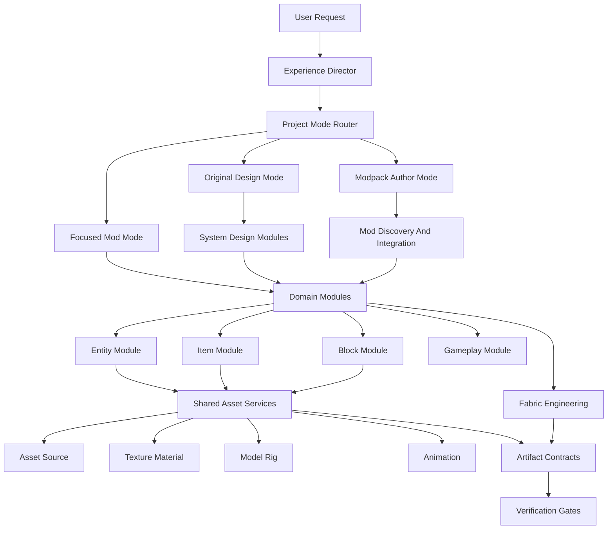

# ModFactory Architecture

ModFactory is a Minecraft game-experience design and production system. Skills are the human-readable operating procedures; scripts are the executable gates; contracts are the shared state between modules.

The goal is to avoid "a file exists, therefore the feature is complete" failures. A module is complete only when its artifacts satisfy their contracts and pass the relevant QA gates.

For product positioning and operating modes, see `docs/modfactory-positioning.md`.

## Layers



## Experience Director

The Experience Director owns the top-level question: what game experience are we trying to create?

It defines gameplay pillars, player journey, project mode, progression loops, constraints, and success criteria before specialist production begins.

## Project Mode Router

The router chooses one of three operating modes:

| Mode | Use When | Primary Output |
|---|---|---|
| Original Design Mode | The creator wants new gameplay systems or custom content | System contracts, progression graph, specialist production tasks |
| Modpack Author Mode | The creator wants to compose existing mods into a coherent pack | Modpack manifest, compatibility graph, conflict report, integration plan |
| Focused Mod Mode | The creator wants one small mod or feature | Narrow feature contract, assets, code/resources, QA gates |

See `docs/modpack-authoring.md` for the Modpack Author Mode workflow.

## Master Orchestrator

`skills/mc-mod-master/SKILL.md` is the command entry point. It should route through the Experience Director when a request is about systems, progression, pack design, or broad gameplay. It can directly coordinate Focused Mod Mode for small scoped requests.

It should not contain every texture, model, animation, or Fabric rule. Those rules live in the module that owns the work and in executable validators.

## Domain Modules

Domain modules own gameplay meaning and feature closure.

| Module | Owns | Does Not Own |
|---|---|---|
| Entity Module | Mob identity, mechanics, AI, dimensions, spawn rules, drops, boss bars, required animation states, `entity.contract.json` | Drawing textures, editing Blockbench rigs, authoring animation keyframes, writing all Fabric code by itself |
| Item Module | Item purpose, stats, use behavior, recipes, creative tab placement, item registration requirements | Pixel art production unless the item shape is trivial |
| Block Module | Block behavior, blockstates, loot, placement, mining rules, model requirements | Texture/material production |
| Gameplay Module | Cross-feature systems such as mana, cooldowns, quests, progression, commands | Low-level assets or isolated content registration |
| Integration Module | Modpack configs, datapacks, tags, recipes, scripts, glue mods, compatibility ownership | Replacing existing mods with custom systems unless the experience requires it |

The Entity Module is one domain module, not the whole system. Its lead skill is `skills/entity-design-expert/SKILL.md`.

## Shared Asset Services

Shared asset services are reusable production specialists. They serve all domain modules.

| Service | Current Files | Responsibility |
|---|---|---|
| Asset Source | `scripts/derive-vanilla-item-texture.ps1`, `scripts/export-bbmodel-assets.ps1` | Locate official Minecraft assets, Blockbench source assets, embedded textures, and provenance |
| Texture Material | `skills/texture-generator/SKILL.md`, `skills/texture-ai-generator/SKILL.md`, `scripts/texture-variant-engine.ps1`, `scripts/lib/TextureVariant.ps1` | Produce item/block/equipment textures, vanilla-derived icons, and UV-safe entity texture variants |
| Model Rig | `scripts/generate-entity-template.ps1`, `templates/entities/*.json`, Blockbench workflows | Produce or adapt model structure, dimensions, part names, UV layout, and Java model expectations |
| Animation | `skills/blockbench-animator/SKILL.md` | Produce animation clips, loop settings, clip naming, and runtime trigger requirements |
| Technical Art | Entity model/renderer/render-state guidance in `skills/entity-generator/SKILL.md` | Bridge assets into runtime render state, model part binding, texture identifiers, and animation state mapping |

## Fabric Engineering

Fabric engineering turns contracts into code and resources:

- `skills/item-generator/SKILL.md`
- `skills/block-generator/SKILL.md`
- `skills/entity-generator/SKILL.md`
- `skills/fabric-mc-mod-development/SKILL.md`

Entity engineering owns `EntityType` registration, attributes, AI goals, DataTracker state, renderer registration, model layer registration, spawn eggs, loot tables, lang keys, and runtime bindings. It consumes asset and animation contracts rather than inventing them.

## Modpack Integration

Modpack Integration turns a pack fantasy and candidate mod list into a coherent pack:

- mod discovery
- feature coverage matrix
- dependency graph
- compatibility graph
- conflict report
- config/datapack/script/glue-code plan
- launch QA matrix

The lead specialist is `skills/conflict-expert/SKILL.md` for compatibility analysis. Integration should prefer configs, datapacks, scripts, tags, and small glue mods before rebuilding existing mod functionality from scratch.

## Contracts

Contracts are the boundary between modules. They must be specific enough for scripts to validate.

For concrete schema examples, see `docs/artifact-contracts.md`.

System design module contracts are described in `docs/system-design-modules.md`.

### Entity Contract

`models/<entity>.contract.json` remains the entity source of truth:

- entity id and display name
- reference source
- entity texture path, dimensions, and source
- Java model path, texture dimensions, and part list
- renderer path and texture identifier
- runtime `EntityType` field, dimensions, spawn egg, boss bar, loot intent
- required animation states

### Asset Contract

Asset contracts describe where visual assets came from and how they were transformed:

```json
{
  "schemaVersion": 1,
  "assetId": "modid:dark_iron_ingot",
  "kind": "item_texture",
  "source": {
    "type": "vanilla_texture",
    "id": "minecraft:iron_ingot",
    "path": "assets/minecraft/textures/item/iron_ingot.png"
  },
  "transform": {
    "type": "palette_map",
    "palette": "dark-iron",
    "preserveDimensions": true,
    "preserveAlpha": true,
    "preserveSilhouette": true
  },
  "output": {
    "path": "src/main/resources/assets/modid/textures/item/dark_iron_ingot.png",
    "width": 16,
    "height": 16
  }
}
```

Use an asset contract whenever source provenance matters. Spawn eggs, ingots, nuggets, gems, tools, armor icons, and vanilla-shaped blocks should not be accepted as random generated art when a vanilla reference exists.

### Animation Contract

Animation contracts describe clips and runtime triggers:

```json
{
  "schemaVersion": 1,
  "entityId": "modid:dark_iron_golem",
  "clips": [
    { "name": "idle", "loop": true, "lengthSeconds": 2.5, "trigger": "ambient_idle" },
    { "name": "walk", "loop": true, "lengthSeconds": 1.2, "trigger": "limb_swing" },
    { "name": "attack_slam", "loop": false, "lengthSeconds": 0.8, "trigger": "successful_melee_attack" },
    { "name": "hurt", "loop": false, "lengthSeconds": 0.35, "trigger": "damage_taken" }
  ],
  "runtime": {
    "stateCarrier": "DataTracker",
    "renderStateClass": "DarkIronGolemRenderState"
  }
}
```

Animation work is not complete when clips exist in Blockbench. It is complete when runtime triggers are mapped and verified.

### Feature Contract

A feature contract ties all generated pieces together:

- requested feature summary
- domain modules involved
- generated entities/items/blocks/systems
- required asset contracts
- required entity contracts
- required animation contracts
- required QA gates

This can start as documentation before it becomes executable.

### Experience And System Contracts

Experience and system contracts sit above feature contracts. They record gameplay pillars, player journey, operating mode, system requirements, progression stages, and specialist handoffs. They are required for broad system design and optional for Focused Mod Mode.

### Modpack Manifest

Modpack manifests record candidate mods, system ownership, dependencies, conflicts, integration actions, and launch QA matrix. They are the source of truth for Modpack Author Mode.

## Verification Gates

Verification is a module, not an afterthought.

| Gate | Tool | Purpose |
|---|---|---|
| Entity asset gate | `scripts/validate-entity-assets.ps1` | Validate entity contract closure, texture dimensions, renderer references, lang, loot, spawn egg resources, registry dimensions |
| Project closure gate | `scripts/integrity-check.ps1` | Validate registered items, blocks, entities, commands, mixins, tags, and resource closure |
| Runtime log gate | `scripts/qa-runclient-check.ps1` | Summarize `runClient` logs for startup, resource reload, crash, and world-entry signals |
| Build gate | `gradlew build` | Compile Java and package resources |
| Manual visual QA | `gradlew runClient` plus in-game checks | Verify scale, texture appearance, spawn egg, animations, boss bars, loot, and interaction behavior |
| Modpack launch matrix | `docs/modpack-authoring.md` process | Verify dependency closure, world creation, progression smoke test, known conflict areas, performance, and dedicated server needs |

Future QA should validate provenance: if an asset contract says a spawn egg is derived from `minecraft:iron_golem_spawn_egg`, the output should preserve dimensions, alpha, and silhouette.

## Dispatch Rule

Every ModFactory task should answer these questions before writing files:

1. Which domain module owns the feature?
2. Which shared asset services are needed?
3. Which contracts will be produced?
4. Which Fabric engineering module consumes those contracts?
5. Which verification gates must pass?

If the answers are unclear, the master orchestrator should stop and ask for clarification instead of generating incomplete files.
