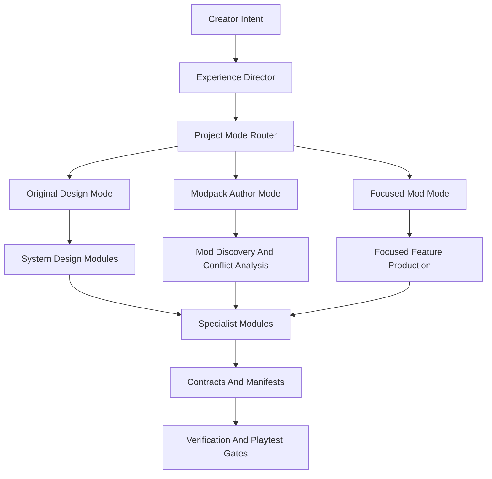

# ModFactory Positioning

ModFactory is a Minecraft game-experience factory. It helps creators design, source, build, integrate, and verify complete gameplay experiences.

The product goal is not just "generate a mod file." ModFactory should understand the intended player journey first, then decide whether to build new content, integrate existing mods, or create a focused standalone feature.

## Three Operating Modes

### Original Design Mode

Use this mode when the creator wants new gameplay systems or custom content.

Examples:

- Design a combat system with weapon stages, armor tiers, enemy roles, boss drops, and status effects.
- Design a tech system with resource acquisition, machines, automation tiers, recipes, and endgame goals.
- Design a magic system with mana, rituals, catalysts, mob drops, and progression gates.

The output is a gameplay system design plus specialist production tasks.

### Modpack Author Mode

Use this mode when the creator wants to compose existing mods into a coherent pack.

Examples:

- Find existing tech, magic, structure, and boss mods that match a pack fantasy.
- Compare overlapping mods and decide which ones should own ores, recipes, dimensions, or progression.
- Detect likely conflicts before trial-and-error launching every combination.
- Plan configs, datapacks, tags, scripts, or small glue mods to make the pack coherent.

The output is a modpack manifest, compatibility graph, conflict report, integration plan, and QA matrix.

### Focused Mod Mode

Use this mode when the creator wants one small mod or one focused feature.

Examples:

- Add a single weapon.
- Add one boss mob.
- Add a new ingot and its recipes.
- Add a small utility block.

The output is a narrow feature contract, required assets, code/resources, and closure checks. This mode should be fast, but not sloppy.

## Product Principle

ModFactory starts from player experience, not file generation.

A sword is not just an item. It is a combat role, a progression stage, a crafting sink, a balance object, an asset, and a code artifact.

A mob is not just an entity. It is combat pacing, loot economy, biome identity, boss progression, visual language, animation triggers, and runtime behavior.

A tech machine is not just a block. It is a resource transformation, recipe gate, automation primitive, UI interaction, save/load object, and progression milestone.

## Studio Model

ModFactory should act like a small game studio:



## Architecture Stack

```text
Experience Director
  -> Project Mode Router
    -> System Design Modules
      -> Domain Modules
        -> Shared Asset Services
        -> Fabric Engineering
          -> Contracts and Manifests
            -> QA Gates
```

`mc-mod-master` remains the command entry point. Conceptually, it should become the mode router and production coordinator. High-level design belongs to the Experience Director.

## Success Criteria

ModFactory succeeds when it can:

- Turn a vague experience goal into gameplay pillars and a player progression plan.
- Decide whether to build custom content, reuse existing mods, or mix both.
- Decompose systems into specialist work without losing the whole game loop.
- Track source provenance for assets and mods.
- Detect resource, runtime, and compatibility failures before the user manually discovers them.
- Support both ambitious modpacks and small focused mods without forcing the same amount of process on both.
