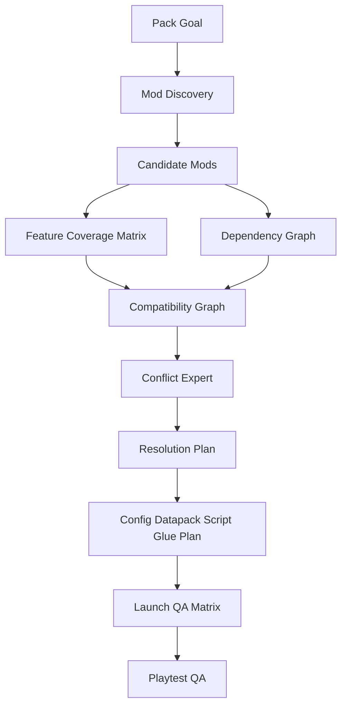

# ModFactory Modpack Author Mode

Modpack Author Mode is for creators who want to compose existing mods into a coherent Minecraft experience instead of building every feature from scratch.

The goal is to replace manual trial-and-error with a systematic workflow:

```text
pack fantasy -> mod discovery -> compatibility graph -> conflict analysis -> integration plan -> launch matrix -> playtest QA
```

## When To Use

Use Modpack Author Mode when the user asks to:

- make a modpack
- find mods that fit a gameplay fantasy
- compare existing mods
- check whether mods conflict
- integrate tech, magic, worldgen, bosses, quests, or progression mods
- design configs, datapacks, scripts, or small glue mods around existing mods

Do not default to custom mod generation if existing mods already cover the requested fantasy and the user is acting as a pack author.

## Workflow



## Mod Discovery

Mod Discovery finds candidate mods based on the pack fantasy, Minecraft version, loader, and required systems.

For each candidate, record:

- mod id and display name
- source URL
- license or redistribution notes
- Minecraft version support
- loader support
- dependencies
- required client/server side
- core features
- config surface
- known incompatibilities
- performance notes

## Feature Coverage Matrix

The coverage matrix prevents duplicate or incoherent systems.

Example categories:

| Category | Questions |
|---|---|
| Combat | Which mod owns weapon variety, armor tiers, enemies, bosses, status effects? |
| Tech | Which mod owns machines, power, automation, logistics, processing chains? |
| Magic | Which mod owns spells, rituals, mana, artifacts, progression gates? |
| Worldgen | Which mod owns ores, biomes, structures, dimensions, terrain? |
| Economy | Which mod owns loot, recipes, resource sinks, trading, rarity? |
| Guide | Which mod owns quests, advancements, guidebooks, onboarding? |

If two mods own the same category, decide whether to:

- keep both and integrate them
- disable one subsystem
- choose one primary owner
- add datapack/script glue
- remove one mod

## Compatibility Graph

The compatibility graph models mod relationships.

Edges should include:

- hard dependency
- optional dependency
- known incompatible
- overlapping content
- recipe/tag integration needed
- config coordination needed
- performance risk
- client-only or server-only mismatch

## Conflict Expert

Conflict Expert checks the modpack before the user manually tests every combination.

It should inspect:

- loader mismatch
- Minecraft version mismatch
- missing dependencies
- incompatible dependency versions
- mixin transformation conflicts
- registry id collisions
- duplicate ores, fluids, items, entities, dimensions, or biomes
- recipe conflicts
- tag conflicts
- biome and worldgen overlap
- client-only mods on server
- server-only mods on client
- config defaults that break progression
- startup logs and crash reports
- performance risks from worldgen, entities, ticking block entities, shaders, or large datapacks

## Resolution Plan

A conflict report must produce concrete actions, not just warnings.

Resolution action types:

- remove mod
- replace mod
- pin version
- add missing dependency
- disable feature in config
- modify recipes with datapack/KubeJS/CraftTweaker-style script
- unify tags
- disable duplicate ores/worldgen
- move content to a different progression stage
- add custom glue mod
- split client/server mod lists

## Integration Plan

Integration makes the modpack feel designed rather than assembled.

Integration can include:

- recipes
- tags
- loot tables
- advancements
- quest lines
- configs
- datapacks
- KubeJS/CraftTweaker-style scripts when appropriate
- resource pack overrides
- small Fabric glue mods

The integration plan should preserve the Experience Director's player journey.

## Launch QA Matrix

Modpack QA should run in stages:

| Stage | Goal |
|---|---|
| Empty launch | Confirm loader and dependencies |
| Core systems launch | Add major systems first: tech, magic, combat, worldgen |
| World creation | Confirm datapacks, worldgen, registries, and server start |
| Progression smoke test | Verify early game acquisition and first unlocks |
| Conflict scenario test | Test known overlap areas: ores, recipes, dimensions, mobs, GUIs |
| Performance pass | Check worldgen, ticking blocks, entity density, client FPS |
| Multiplayer pass | If needed, test dedicated server and joining clients |

## Modpack Manifest

Modpack Author Mode should produce `modpack.manifest.json` or equivalent.

Minimum fields:

- pack id and fantasy
- Minecraft version
- loader and loader version
- mods and versions
- dependencies
- selected owner for each system category
- known conflicts
- resolution actions
- integration assets
- launch matrix
- QA evidence

## Handoff To Specialists

Modpack Author Mode can dispatch to:

- Experience Director for pack fantasy and player journey
- System Designers for progression and category ownership
- Mod Discovery for candidate selection
- Conflict Expert for compatibility analysis
- Integration Expert for configs/datapacks/scripts/glue code
- QA Expert for launch matrix and playtest evidence

Custom content should be generated only when existing mods cannot satisfy the intended experience or when the user wants unique identity.
