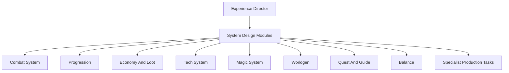

# ModFactory System Design Modules

System design modules sit between Experience Director and specialist production. They define gameplay systems before assets, entities, items, blocks, configs, or code are produced.

## Module Map



## Combat System Designer

Owns combat feel, enemy roles, gear roles, and difficulty pacing.

Defines:

- weapon classes and combat roles
- armor tiers and defensive identities
- enemy archetypes: swarm, bruiser, sniper, summoner, boss, hazard
- damage curves and health ranges
- status effects, cooldowns, knockback, range, mobility
- boss phases and encounter pacing

Outputs:

- weapon and armor requirements
- entity role requirements
- animation state requirements
- balance ranges
- combat QA scenarios

## Progression Designer

Owns the player's unlock journey.

Defines:

- early/mid/late/endgame stages
- unlock gates and dependencies
- resource acquisition loops
- crafting chains
- exploration or boss gates
- failure states where the player can get stuck

Outputs:

- progression graph
- feature ordering
- required recipes, drops, structures, machines, or quests
- stage-by-stage QA checklist

## Economy And Loot Designer

Owns resource sources, sinks, rarity, and reward quality.

Defines:

- mob drops
- block drops
- chest loot
- crafting sinks
- repair materials
- rare items
- renewable vs non-renewable resources
- farming and exploit risks

Outputs:

- loot tables
- recipe requirements
- tag requirements
- resource balance checks

## Tech System Designer

Owns machines, automation, energy, fluids, item routing, and tech progression.

Defines:

- machine tiers
- input/output transformations
- power or heat systems
- fluids, gases, or item networks
- multiblocks
- automation loops
- GUI and block entity requirements
- save/load risks

Outputs:

- machine feature contracts
- block/entity requirements
- recipe graph
- network and GUI requirements
- tech QA scenarios

## Magic System Designer

Owns spells, rituals, mana-like resources, catalysts, and magical progression.

Defines:

- resource model: mana, souls, essence, charges, cooldowns
- spell schools or archetypes
- ritual structures
- catalysts and reagents
- progression gates
- failure costs and balance limits

Outputs:

- item/block/entity requirements
- particle/sound/asset requirements
- data/component requirements
- magic QA scenarios

## Worldgen Designer

Owns ores, biomes, structures, dimensions, and exploration rewards.

Defines:

- ore distribution
- biome constraints
- structure placement
- dimension rules
- spawn conditions
- exploration rewards
- performance risks

Outputs:

- worldgen data requirements
- block and item requirements
- loot and spawn requirements
- worldgen QA checklist

## Quest And Guide Designer

Owns player onboarding, guidance, and objective flow.

Defines:

- advancement tree
- guidebook chapters
- tutorial tasks
- system explanations
- hidden vs explicit progression
- player-facing names and descriptions

Outputs:

- advancement requirements
- lang key requirements
- guidebook/task requirements
- onboarding QA checklist

## Balance Designer

Owns numbers and exploit checks across systems.

Defines:

- health, damage, armor, speed, cooldown, durability ranges
- recipe costs
- drop rates
- machine rates
- XP/reward rates
- multiplayer scaling
- exploit checks

Outputs:

- balance table
- tuning assumptions
- playtest scenarios
- risk list

## Contract Output

Each system module should output or contribute to a `system.contract.json`:

```json
{
  "schemaVersion": 1,
  "systemId": "modid:dark_combat_progression",
  "type": "combat",
  "playerStages": ["early", "mid", "late", "endgame"],
  "requiredFeatures": [
    "dark_iron_weapon_tier",
    "dark_iron_golem_boss",
    "shadow_status_effect"
  ],
  "specialists": ["weapon", "armor", "entity", "asset-source", "texture-material", "fabric-engineering", "qa"],
  "qa": ["stage_progression", "combat_balance", "loot_loop"]
}
```

## Handoff Rule

Specialists should not begin production until the owning system module has defined:

1. player-facing purpose
2. progression stage
3. required artifacts
4. source/provenance constraints
5. QA expectations

Focused Mod Mode can use a smaller version of this rule, but it should not skip it when the feature affects progression, balance, or runtime behavior.
